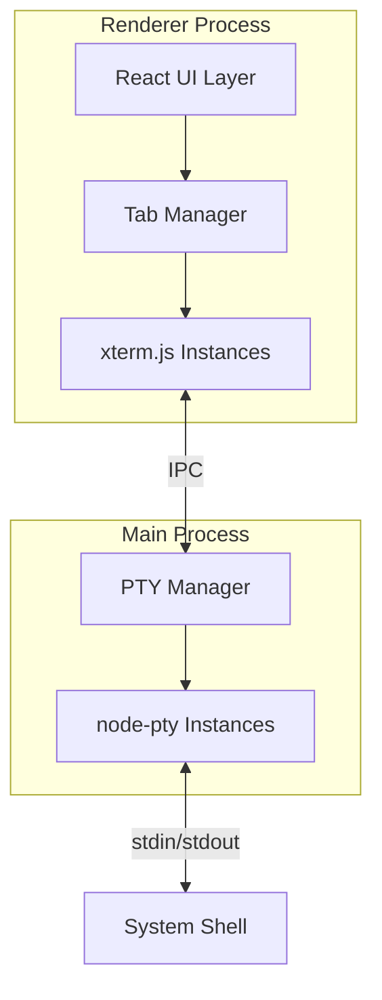

## Product Overview

一个基于 xterm.js + node-pty 的本地终端应用，提供完整的终端模拟功能，支持多终端实例管理，每个终端 tab 独立运行系统默认 shell 进程。

## Core Features

- 多终端 Tab 管理：支持创建、切换、关闭多个独立终端实例
- 完整终端模拟：基于 xterm.js 实现终端 UI 渲染，支持 ANSI 转义序列、颜色显示
- 真实 Shell 进程：通过 node-pty 为每个终端创建独立的伪终端进程
- 终端交互：支持命令输入、输出显示、快捷键操作
- 终端尺寸自适应：窗口大小变化时自动调整终端尺寸

## Tech Stack

- 前端框架：Electron + React + TypeScript
- 终端渲染：xterm.js + xterm-addon-fit
- 伪终端：node-pty
- 进程通信：Electron IPC (Main Process <-> Renderer Process)
- 样式：Tailwind CSS

## Tech Architecture

### System Architecture



### Module Division

- **Tab Manager Module**：管理终端 tab 的创建、切换、关闭，维护 tab 与 PTY 实例的映射关系
- **XTerm Module**：封装 xterm.js 实例，处理终端渲染、用户输入、尺寸调整
- **PTY Manager Module**：在主进程中管理 node-pty 实例的生命周期
- **IPC Bridge Module**：封装主进程与渲染进程之间的通信逻辑

### Data Flow


## Implementation Details

### Core Directory Structure

```
project-root/
├── src/
│   ├── main/
│   │   ├── index.ts              # Electron 主进程入口
│   │   ├── ptyManager.ts         # PTY 实例管理器
│   │   └── ipcHandlers.ts        # IPC 事件处理
│   ├── renderer/
│   │   ├── App.tsx               # React 应用入口
│   │   ├── components/
│   │   │   ├── TerminalTabs.tsx  # Tab 栏组件
│   │   │   └── Terminal.tsx      # 单个终端组件
│   │   ├── hooks/
│   │   │   └── useTerminal.ts    # 终端逻辑 Hook
│   │   └── services/
│   │       └── terminalIpc.ts    # IPC 通信封装
│   ├── shared/
│   │   └── types.ts              # 共享类型定义
│   └── preload/
│       └── index.ts              # Preload 脚本
├── package.json
└── electron-builder.json
```

### Key Code Structures

**TerminalInstance 接口**：定义终端实例的核心数据结构，包含唯一标识符、显示标题和运行状态。

```typescript
interface TerminalInstance {
  id: string;
  title: string;
  isActive: boolean;
}
```

**PTYManager 类**：主进程中管理所有 node-pty 实例，负责创建、销毁伪终端进程，处理数据流转发。

```typescript
class PTYManager {
  private instances: Map<string, IPty>;
  create(id: string, cols: number, rows: number): void;
  write(id: string, data: string): void;
  resize(id: string, cols: number, rows: number): void;
  destroy(id: string): void;
}
```

**IPC 通道定义**：定义主进程与渲染进程之间的通信协议。

```typescript
// IPC Channels
const IPC_CHANNELS = {
  PTY_CREATE: 'pty:create',
  PTY_DATA: 'pty:data',
  PTY_RESIZE: 'pty:resize',
  PTY_DESTROY: 'pty:destroy',
  PTY_OUTPUT: 'pty:output',
  PTY_EXIT: 'pty:exit'
};
```

### Technical Implementation Plan

**1. node-pty 与 Electron 集成**

- 问题：node-pty 是原生模块，需要针对 Electron 版本重新编译
- 方案：使用 electron-rebuild 在安装后自动重编译原生模块
- 步骤：配置 postinstall 脚本，确保 node-pty 与 Electron 版本匹配

**2. 多终端实例隔离**

- 问题：每个 tab 需要独立的 shell 进程和 xterm 实例
- 方案：使用 Map 结构管理实例映射，通过唯一 ID 关联 xterm 与 pty
- 步骤：创建 tab 时生成 UUID，同时创建 xterm 和 pty 实例

**3. 终端尺寸同步**

- 问题：窗口大小变化时需同步调整 xterm 和 pty 的尺寸
- 方案：使用 xterm-addon-fit 自动计算尺寸，通过 IPC 同步到 pty
- 步骤：监听 resize 事件，调用 fit()，发送新尺寸到主进程

### Integration Points

- **Electron IPC**：使用 contextBridge 暴露安全的 IPC 方法
- **xterm.js Addons**：集成 fit addon 处理尺寸自适应
- **Shell 环境**：使用 process.env.SHELL 或系统默认 shell

## Technical Considerations

### Performance Optimization

- 使用 requestAnimationFrame 批量处理终端输出
- 限制 xterm 滚动缓冲区大小防止内存溢出
- 非活动 tab 的终端实例保持运行但减少渲染频率

### Security Measures

- 使用 contextIsolation 和 preload 脚本隔离渲染进程
- 禁用 nodeIntegration，通过 contextBridge 暴露有限 API

## Agent Extensions

### SubAgent

- **code-explorer**
- Purpose：探索现有项目结构，了解当前代码架构和依赖配置
- Expected outcome：获取项目的目录结构、package.json 配置、现有组件结构等信息，确保新功能与现有代码风格一致